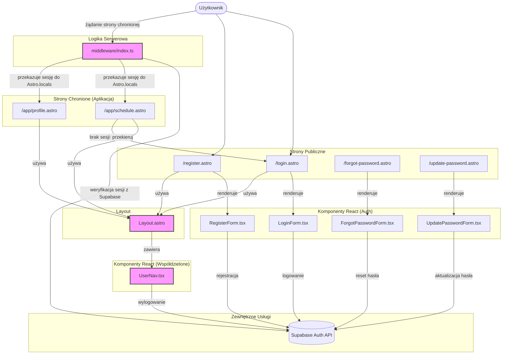

<architecture_analysis>
Na podstawie dostarczonej dokumentacji, w tym PRD i specyfikacji technicznej modułu autentykacji, oraz analizy istniejącej struktury projektu, przygotowałem analizę architektury UI dla nowego modułu logowania i rejestracji.

### 1. Komponenty i Strony

**Nowe Strony (Astro):**

- `src/pages/login.astro`: Publiczna strona renderująca formularz logowania.
- `src/pages/register.astro`: Publiczna strona renderująca formularz rejestracji.
- `src/pages/forgot-password.astro`: Strona do inicjowania procesu resetowania hasła.
- `src/pages/update-password.astro`: Strona do ustawiania nowego hasła (docelowa dla linku z e-maila).

**Nowe Komponenty (React):**

- `src/components/auth/LoginForm.tsx`: Formularz do wprowadzania e-maila i hasła, obsługujący walidację i komunikację z Supabase.
- `src/components/auth/RegisterForm.tsx`: Formularz rejestracji (e-mail, hasło, powtórz hasło) z walidacją.
- `src/components/auth/ForgotPasswordForm.tsx`: Formularz z polem na e-mail do wysłania linku resetującego.
- `src/components/auth/UpdatePasswordForm.tsx`: Formularz do wprowadzenia i potwierdzenia nowego hasła.
- `src/components/auth/UserNav.tsx`: Komponent nawigacyjny w nagłówku, wyświetlający opcje zależne od stanu zalogowania użytkownika (Zaloguj/Zarejestruj lub Profil/Wyloguj).

**Zmodyfikowane Pliki:**

- `src/layouts/Layout.astro`: Główny layout aplikacji, który zostanie zaktualizowany, aby zawierał `UserNav.tsx` i warunkowo renderował jego zawartość na podstawie sesji użytkownika pobranej z `Astro.locals`.
- `src/middleware/index.ts`: Kluczowy element logiki serwerowej, odpowiedzialny za zarządzanie sesją Supabase (odczyt, weryfikacja, odświeżanie tokenów) i udostępnianie jej w `Astro.locals`.
- Strony w `src/pages/app/**`: Wszystkie strony wymagające autentykacji (np. `schedule.astro`, `profile.astro`) zostaną zabezpieczone poprzez sprawdzenie sesji na początku pliku i przekierowanie do `/login` w przypadku jej braku.

### 2. Główne Strony i Ich Komponenty

- **Strona Logowania (`/login`):**
  - `login.astro` (Strona Astro)
  - `LoginForm.tsx` (Komponent React)
- **Strona Rejestracji (`/register`):**
  - `register.astro` (Strona Astro)
  - `RegisterForm.tsx` (Komponent React)
- **Layout Aplikacji:**
  - `Layout.astro` (Layout Astro)
    - `UserNav.tsx` (Komponent React, współdzielony)

### 3. Przepływ Danych

1.  Użytkownik (niezalogowany) wchodzi na stronę główną. `Layout.astro` renderuje `UserNav.tsx`, który wyświetla linki "Zaloguj się" i "Zarejestruj się".
2.  Użytkownik przechodzi do `/login` lub `/register`. Odpowiednia strona Astro renderuje komponent formularza React (`LoginForm` lub `RegisterForm`).
3.  Formularz React komunikuje się bezpośrednio z Supabase Auth API (`supabase.auth.signInWithPassword()` lub `supabase.auth.signUp()`) w przeglądarce.
4.  Po pomyślnym logowaniu/rejestracji, biblioteka `supabase-js` ustawia ciasteczka sesji. Użytkownik jest przekierowywany do strony chronionej, np. `/app/schedule`.
5.  Żądanie dotarcia do `/app/schedule` jest przechwytywane przez `src/middleware/index.ts`.
6.  Middleware odczytuje ciasteczka, weryfikuje sesję z Supabase i umieszcza dane sesji w `Astro.locals.session`.
7.  Strona `schedule.astro` sprawdza `Astro.locals.session`. Ponieważ sesja istnieje, strona jest renderowana.
8.  `Layout.astro` ponownie odczytuje `Astro.locals.session` i renderuje `UserNav.tsx`, który tym razem wyświetla menu z opcjami "Profil" i "Wyloguj się".

### 4. Opis Funkcjonalności Komponentów

- **Strony `.astro`**: Pełnią rolę kontenerów (szablonów HTML) dla komponentów React i realizują logikę po stronie serwera (np. ochrona trasy).
- **Komponenty `Form.tsx`**: Odpowiadają za interakcję z użytkownikiem, walidację danych wejściowych (z użyciem `zod`) i bezpośrednią komunikację z API Supabase Auth po stronie klienta.
- **`UserNav.tsx`**: Komponent współdzielony, który dynamicznie dostosowuje UI w zależności od stanu autentykacji użytkownika.
- **`Layout.astro`**: Centralny punkt aplikacji, integrujący nawigację i zarządzanie sesją na poziomie widoku.
- **`middleware/index.ts`**: Serce logiki autentykacji po stronie serwera, zapewniające spójność sesji między klientem a serwerem.
  </architecture_analysis>

<mermaid_diagram>

</mermaid_diagram>
